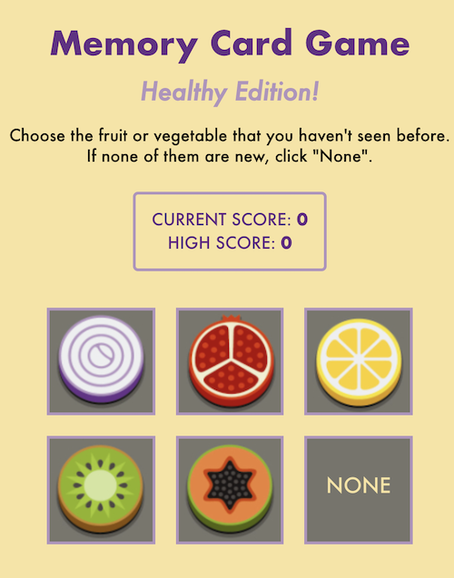

# Memory Card Game: _Healthy Edition_

Not only is this memory game an exercise for your mind, it also contains more than enough fruits and vegetables to get your five-a-day (on a serious note though: eat your veggies). The game is simple enough: click on the image you haven't seen before, and watch your score go up. Click on the wrong card though, and your score resets to zero. Don't worry though - your high score is saved for subsequent rounds so you have a target to beat!

:zap:[Live Demo](https://kuosandys.github.io/memory-card-game/):zap:

## Purpose

This web-based game is built with React and demonstrates an understanding of the lifecycle of components. All the components are function-based components and uses hooks to set and update state, as well as use the effect of each render to call a function to randomize the cards for the next round.

## Built With

- React (project initialized with create-react-app)
- styled-components
